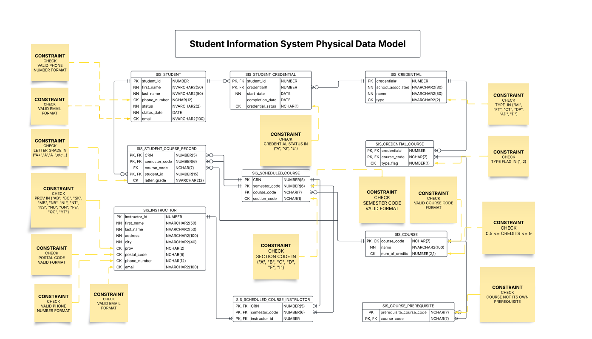

# Student Information System (SIS) - BAIT

## Project Overview

This project is a complete relational database system for the Balzac Advanced Institute of Technology (BAIT), designed to track students, instructors, programs, courses, and credentials. The SIS replaces BAIT’s old system of spreadsheets, sticky notes, and cardboard boxes. The end goal: a robust Oracle 12c/21c database, fully normalized and packed with features for real-world reporting and analytics.

The business rules, requirements, and background come straight from a fictional consulting agency. The database was designed, built, and populated by me, with a little AI help for data generation.

---

## Project Stages

### 1. Conceptual Model

- I started by mapping out all the core entities (Student, Instructor, Credential, Course, etc.) and their relationships.
- Used Lucidchart to draw the conceptual, logical, and physical diagrams. You’ll find the main ERD here:  

### 2. Logical & Physical Model

- Added all attributes, primary keys, foreign keys, and mapped out all many-to-many relationships using bridging tables.
- Normalized everything to 3NF for data integrity and future-proofing.
- Picked data types to match business rules (e.g., `NVARCHAR2` for names, strict formats for phone numbers, etc.).
- Added all the necessary constraints—PKs, FKs, NOT NULLs, and custom checks for fields like email, phone, postal code.
  

### 3. Table Construction

- Wrote a full SQL build script (`Project Delivery Final\build_and_populate\Build\Group4.projectcreate.sql`) to create every table, bridge, and constraint.
- Multiple composite keys used for the bridging tables to keep everything normalized.

### 4. Sample Data Population

- Populated all tables with sample data using a dedicated SQL script (`Project Delivery Final\build_and_populate\Populate\Group4LabUnit9Output.txt`).
- Used AI to generate realistic data for students, instructors, course enrollments, and grades. With this many relationships, AI made this process much less tedious.

### 5. Query Reports

- Wrote four non-trivial SQL report scripts, each showing off different Oracle SQL features (aggregations, subqueries, user prompts, rollups, etc.)
- Each report is in its own folder under `/Project Delivery Final/`, with the script, sample output, and a short README.
- All scripts are made for SQL*Plus, but will also work in VS Code with an SQL*Plus extension.

---

## Entities & Relationships (Summary)

- **Student**: Tracks all student info, status (active, probation, suspended, etc.), contact info.
- **Instructor**: Handles instructor identity and contact details.
- **Credential**: Programs, degrees, diplomas, etc.
- **Course**: Courses offered at BAIT.
- **Scheduled Course**: Course offerings by semester and section.
- **Bridging Tables**: Connect students to credentials, credentials to courses (with required/optional flags), and scheduled courses to instructors.

---

## Reports & Features

### 1. Instructor Sections Class Average
- Purpose: Show which instructors are teaching which sections, along with the class average for each section.  
- SQL feature: Uses a `CASE` statement to translate letter grades into numeric values for averaging.

```SQL
AVG(
    CASE scr.letter_grade
        WHEN N'A+' THEN 100
        WHEN N'A' THEN 89
        ...
        WHEN N'F' THEN 0
        WHEN N'I' THEN NULL
        ELSE NULL
    END
) AS class_avg
```
See r1_instructor_sections_class_average folder for script and output.


### 2. Student At Risk by Program
- Purpose: Find out which programs have the highest number (and percentage) of “FLAGGED” students (status = Expelled, Suspended, or Academic Probation).
- SQL feature: Uses COUNT(...) and ROLLUP to show subtotals and grand totals for flagged students, and calculates percentage.

```SQL
COUNT(CASE WHEN s.status IN ('E', 'S', 'AP') THEN s.student_id END) AS flagged_student,
LPAD(TO_CHAR(
    ROUND(
        COUNT(CASE WHEN s.status IN ('E', 'S', 'AP') THEN s.student_id END) 
        * 100.0 / COUNT(sc.student_id), 0
    )
) || '%',10) AS flagged_pct
```
See r2_student_at_risk folder for script and output.


### 3. List Students by Inputted Course
- Purpose: Lists all students who have taken a specific course, based on user input.
- SQL feature: Uses the '&' substitution variable for interactive querying in SQL*Plus.

```SQL
WHERE scr.course_code = UPPER(TRIM('&course_code'))
```
See r3_list_students_by_inputted_course folder for script and output.


### 4. High Performing Students
- Purpose: Identify students who have a higher-than-average grade compared to their peers in the same program. Good for finding honor students or scholarship candidates.
- SQL feature: Uses subqueries, joins, grouping, and percentage calculations to compare individual averages with program averages.

```SQL
WITH program_avg AS (
    SELECT c.credential_number,
        AVG(
            CASE scr.letter_grade
                WHEN N'A+' THEN 100
                WHEN N'A' THEN 89
                ...
                ...
                ...
                ELSE NULL
            END
        ) AS total_avg
), 
student_avg AS (
    SELECT s.student_id, scred.credential_number,
        AVG(
            CASE scr.letter_grade
                WHEN N'A+' THEN 100
                ...
                ...
                ...
                ELSE NULL
            END
        ) AS total_avg
)
SELECT s.student_id, s.first_name, s.last_name, 
...
...
...
WHERE sa.total_avg > pa.total_avg
```
See r4_high_performing_students folder for script and output.

---

### How to Run:

1. Use Oracle SQLPlus or VS Code with the SQLPlus extension.

2. Make sure your session is pointed at the schema you want to use.

3. Run the build script first to create all tables and constraints.

4. Run the populate script to insert sample data.

5. Each report folder has a script, a README, and a sample output. Just copy-paste the SQL into SQL*Plus, or use the @ command to run the script.

---

### What I Learned:

- Got a lot better at designing and planning a database from scratch.

- Learned how to normalize complex data into third normal form using bridging tables and composite keys.

- Improved at writing and enforcing constraints to keep the data clean.

- Levelled up my Oracle SQL query skills, especially with aggregation, subqueries, and rollups.

- Realized that generating complex sample data by hand is tedious, and using AI tools can be a huge time-saver.

---

### AI Contribution
- I used AI (ChatGPT) to generate most of the sample data for students, credentials, enrollments, and course records.
- I also used AI to help brainstorm report ideas and SQL scripts, especially when working with tricky Oracle syntax.

---

### Special Note
- Due to strict project requirements, some instructor-course mappings might not reflect real-world departmental logic.
- The instructor table did not include a department field, so assignments may appear “random” at first glance.